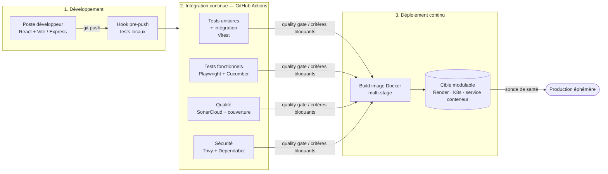

# EventSphere — Chaîne de développement industrialisée pour applications événementielles

> **Réponse à l'annexe A de l'appel d'offres** — *Développement et déploiement d'applications événementielles.*
>
> Ce dépôt n'est pas une application « finale » : c'est un **démonstrateur** d'une **chaîne de développement industrialisée** permettant de concevoir, tester, sécuriser et déployer rapidement des applications métier éphémères, tout en garantissant un niveau de qualité et de sécurité homogène.

L'application de démonstration retenue est un **portail d'inscription à un événement** (« Salon de la Tech 2026 ») : le visiteur s'inscrit, l'API valide la demande et génère un identifiant de badge. Ce cas d'usage figure parmi ceux cités dans l'annexe (§3 : *gestion des accréditations*). Il reste volontairement simple pour laisser la **chaîne outillée** au premier plan.

> **La pile technique est un choix d'illustration, pas une contrainte.** Express et React servent ici à matérialiser la démarche, mais ce sont des **briques interchangeables**. La chaîne (CI/CD, qualité, sécurité, tests, conteneurisation, déploiement) est **agnostique du langage et du framework** : selon le besoin du client, l'équipe disponible ou les contraintes de l'événement, on peut substituer une autre pile (Vue/Svelte/Angular côté front ; Fastify, Python/FastAPI, Go, Java/Spring… côté back) **sans changer la démarche ni les portes de contrôle**. C'est précisément l'objectif du §2 de l'annexe : *un niveau de qualité homogène quelles que soient les technologies retenues*.

---

## 1. Positionnement vis-à-vis de l'appel d'offres

L'objectif de l'annexe (§2) n'est pas de livrer une application particulière mais de **réduire le délai entre l'expression du besoin et la mise en production**, sans sacrifier la qualité ni la sécurité. Notre démarche répond à chacun des six axes du §4 :

| Axe de l'annexe | Réponse apportée | Où le voir |
|---|---|---|
| **4.1 Développement rapide** | React + Vite, API Express minimale, logique métier en fonctions pures réutilisables, assistance IA encadrée | [§4](#4-développement-rapide-annexe-41) |
| **4.2 Industrialisation** | Build reproductible (Vite + Docker multi-stage), versionnage Git, CI GitHub Actions | [§5](#5-industrialisation-de-la-construction-annexe-42) |
| **4.3 Qualité logicielle** | SonarCloud (analyse statique, duplications, quality gate) + couverture LCOV | [§6](#6-qualité-logicielle-annexe-43) |
| **4.4 Sécurité** | SCA (Trivy + Dependabot), analyse statique, critères bloquants — *Security by Design* | [§7](#7-sécurité-des-développements-annexe-44) |
| **4.5 Tests automatisés** | Unitaires (Vitest), intégration (supertest), fonctionnels (Playwright + Cucumber BDD) | [§8](#8-tests-automatisés-annexe-45) |
| **4.6 Déploiement** | Conteneurisation + déploiement continu (Render pour la démo, cible substituable jusqu'à K8s/GitOps), sonde de santé, rollback | [§9](#9-déploiement-automatisé-annexe-46) |

---

## 2. Architecture générale de la chaîne



**Principe directeur :** chaque modification (`push` / *pull request*) traverse automatiquement les mêmes portes de contrôle — tests, qualité, sécurité — avant toute mise en production. Aucune étape manuelle n'est requise pour qu'une régression ou une vulnérabilité connue bloque la livraison.

### Composants du démonstrateur

```
┌─────────────┐     HTTP/JSON      ┌──────────────┐
│  Front SPA  │  ───────────────►  │  API Express │
│ React+Vite  │  ◄───────────────  │  (server/)   │
│ (client/)   │   badge / erreurs  │              │
└─────────────┘                    └──────────────┘
        │                                  │
        └──── logique métier partagée ─────┘
              (src/ — fonctions pures)
```

- **`src/`** — logique métier **pure** (validation, génération de badge), sans dépendance au DOM ni à Express → testable unitairement et réutilisable des deux côtés.
- **`server/`** — API REST Express (`app.js` exporte l'app, `index.js` la démarre) ; séparation qui permet de tester l'API avec *supertest* sans ouvrir de port.
- **`client/`** — interface React construite par Vite, servie en statique par nginx en production.

---

## 3. Cycle de vie d'une application (du besoin à la production)

1. **Amorçage** — on part de ce squelette (framework rapide + chaîne CI/CD déjà câblée). Le développeur se concentre sur la logique métier spécifique à l'événement.
2. **Développement** — logique métier écrite en fonctions pures dans `src/`, exposée par l'API (`server/`) et l'IHM (`client/`). Assistance IA utilisée pour générer squelettes de code, cas de tests et interfaces (voir §4).
3. **Contrôle local** — un *hook* Git `pre-push` (Husky) lance les tests avant tout envoi : on ne pousse pas du code cassé.
4. **Intégration continue** — à chaque `push`/PR, GitHub Actions exécute tests, analyse qualité et analyses de sécurité.
5. **Portes de qualité/sécurité** — la *quality gate* SonarCloud et les critères bloquants Trivy (sévérités `CRITICAL`/`HIGH`) doivent passer.
6. **Déploiement continu** — sur la branche de production, l'image Docker est construite et déployée automatiquement sur Render, avec sonde de santé.
7. **Fin de vie** — l'application étant éphémère, le service est arrêté à la fin de l'événement. Dans **ce démonstrateur**, les données sont conservées **en mémoire** (aucune persistance résiduelle à purger). ⚠️ **Pour un projet réel, ce n'est pas suffisant** : les inscriptions/accréditations doivent survivre à un redémarrage et sont souvent intégrées au SI du client (annexe §1) — une **base de données** (ou tout autre stockage durable) est alors requise. La chaîne l'accueille sans modification (mêmes tests, mêmes portes qualité/sécurité, même déploiement) ; la fin de vie devient alors une **purge maîtrisée et volontaire** des données, et non un simple arrêt.

---

## 4. Développement rapide (annexe §4.1)

**Une pile modulable, pas imposée.** Les technologies ci-dessous sont celles du **démonstrateur** ; elles ont été choisies pour leur rapidité de mise en œuvre, mais restent **substituables**. Ce qui ne change pas d'un projet à l'autre, c'est la **méthode** : logique métier isolée et réutilisable, tests à chaque niveau, portes qualité/sécurité automatisées, packaging conteneurisé et déploiement continu. Un autre besoin client → une autre pile, **la même chaîne**.

**Choix technologiques du démonstrateur et justification :**

| Choix | Pourquoi | Alternatives possibles (même chaîne) |
|---|---|---|
| **Vite** | Démarrage et *build* quasi instantanés, HMR immédiat → boucle de dev très courte | Tout *bundler* / outil de build (Webpack, esbuild, Turbopack…) |
| **React** | Composants réutilisables, large vivier de compétences → montée en charge rapide des équipes | Vue, Svelte, Angular, ou rendu serveur (Next, Nuxt…) |
| **Express** | API REST minimale en quelques lignes, très connue → peu de code spécifique | Fastify, NestJS, Python/FastAPI, Go, Java/Spring… |
| **Fonctions pures (`src/`)** | Réutilisation front/back de la **même** logique de validation → pas de double implémentation | Principe indépendant du langage |

Ce **découplage assumé** (métier ↔ transport ↔ IHM) est ce qui rend la substitution possible : remplacer Express par un autre framework n'impacte que la couche `server/` ; remplacer React n'impacte que `client/`. La logique métier et l'ensemble de la chaîne d'industrialisation restent inchangés.

**Réutilisation de composants :** la validation d'inscription et la génération de badge sont centralisées dans `src/inscription.mjs` et `src/utils.mjs`, consommées à la fois par l'API et (potentiellement) par le front. Un nouveau projet événementiel réutilise ce squelette et sa chaîne CI/CD sans repartir de zéro.

**Assistance par IA (usage raisonné) :** des outils d'assistance au développement (génération de code, d'interfaces et de **jeux de tests**) sont utilisés pour accélérer la production. Le principe est un usage **encadré** : tout code ou test généré passe par les mêmes portes que le reste (revue, analyse statique, couverture, quality gate). L'IA accélère la production ; la chaîne automatisée garantit que la qualité et la sécurité ne dépendent pas de son origine.

---

## 5. Industrialisation de la construction (annexe §4.2)

- **Organisation du code source** — séparation claire `src/` (métier) · `server/` (API) · `client/` (IHM) · `tests/` (par type). Point d'entrée serveur isolé de l'app pour la testabilité.
- **Gestion des versions** — Git, développement par branches et *pull requests* ; la CI s'exécute sur `push` et sur les PR ciblant la branche principale.
- **Compilation / packaging** — `npm run build` (Vite) produit un *bundle* statique optimisé ; le **`Dockerfile` multi-stage** compile le front puis ne conserve qu'une image nginx légère (`nginx:alpine`) servant les fichiers statiques → image finale minimale, surface d'attaque réduite.
- **Automatisation du build** — orchestrée par **GitHub Actions**. Le build Docker est reproductible (`npm ci` sur *lockfile* figé).

**Intégration continue (CI) :** quatre workflows GitHub Actions découplés :

| Workflow | Rôle | Déclenchement |
|---|---|---|
| `vitest.yml` | Tests unitaires + intégration | `push` / PR |
| `playwright.yml` | Tests fonctionnels (e2e + BDD) + rapport | `push` / PR sur `main` |
| `sonarqube.yml` | Qualité + couverture → SonarCloud | `push` / PR sur `main` |
| `trivy.yml` | Analyse de sécurité (dépendances/artefacts) | `push` / PR sur `main` |

---

## 6. Qualité logicielle (annexe §4.3)

Chaque modification est contrôlée automatiquement **avant** toute mise en production via **SonarCloud** :

- **Analyse statique** du code (`sonar-project.properties`, sources `src,server,client`).
- **Respect des règles de qualité** via la *Quality Gate* SonarCloud (bloquante sur PR).
- **Détection des duplications** (native SonarCloud).
- **Mesure de la couverture des tests** — rapport **LCOV** généré par Vitest (`npm run coverage`) et transmis à SonarCloud ; la base de code testable est couverte à 100 %.
- **Indicateurs de qualité** — fiabilité, sécurité, maintenabilité, dette technique suivis dans le tableau de bord SonarCloud.

Les exclusions de couverture sont explicitement justifiées dans `sonar-project.properties` (front couvert par les tests e2e, point d'entrée serveur, fichiers de configuration).

---

## 7. Sécurité des développements (annexe §4.4)

Approche **« Security by Design » / « Security by Default »** : les contrôles sont intégrés au cycle, pas ajoutés après coup.

### Contrôles en place

| Type | Outil | Détail |
|---|---|---|
| **SCA — dépendances** | **Trivy** (`scan-type: fs`) | Vulnérabilités des dépendances, échec CI sur `CRITICAL`/`HIGH` |
| **SCA — mises à jour** | **Dependabot** | PR automatiques quotidiennes (npm, GitHub Actions, Docker), groupées |
| **Analyse statique de sécurité** | **SonarCloud** (+ CodeQL *default setup* GitHub) | Règles de sécurité, *hotspots* ; deux ReDoS déjà corrigés grâce à ces analyses |
| **Critères bloquants** | Trivy `exit-code: 1` + Quality Gate | Aucune mise en production si une vulnérabilité connue de sévérité élevée est présente |

**Bonnes pratiques applicatives** intégrées au démonstrateur : limite de taille du corps JSON (garde-fou anti-abus), CORS explicite et restreint aux méthodes utiles, gestion centralisée des erreurs, **non-exposition des données personnelles** (les e-mails ne sont jamais renvoyés par l'API de listing).

### Renforcements planifiés (feuille de route sécurité)

Pour couvrir intégralement le §4.4, les contrôles suivants sont prévus (non encore câblés dans ce dépôt) :

- **DAST** — analyse dynamique de l'application déployée (p. ex. OWASP ZAP en CI).
- **Détection de secrets** — Gitleaks / Trivy *secret scanning* sur l'historique et les commits.
- **Vulnérabilités des images** — scan Trivy en mode `image` sur l'image Docker **produite** (aujourd'hui seul le système de fichiers est scanné).

Ces trois éléments sont documentés ici en toute transparence : la chaîne est conçue pour les accueillir comme des étapes supplémentaires du même pipeline, sans refonte.

---

## 8. Tests automatisés (annexe §4.5)

Stratégie en pyramide, entièrement exécutée en CI :

| Niveau | Outil | Emplacement | Ce qui est vérifié |
|---|---|---|---|
| **Unitaire** | Vitest | `tests/unit/` | Validation, génération de badge, utilitaires (fonctions pures) |
| **Intégration** | Vitest + supertest | `tests/integration/` | Contrat de l'API Express (codes HTTP, erreurs, CORS, non-exposition e-mail) |
| **Fonctionnel e2e** | Playwright | `tests/e2e/` | Parcours utilisateur dans un vrai navigateur |
| **Fonctionnel BDD** | Cucumber (`.feature` en français) | `tests/features/` | Scénarios métier lisibles par le client |

- **Génération assistée par IA** de cas de test et de jeux de données, revus puis intégrés à la suite.
- **Exécution automatique** dans la CI à chaque `push`/PR ; les régressions sont détectées immédiatement, sans intervention manuelle.
- Le *hook* `pre-push` rejoue les tests localement avant même d'atteindre la CI.

---

## 9. Déploiement automatisé (annexe §4.6)

**Une cible de déploiement modulable.** L'élément qui rend la chaîne portable est l'**image Docker** : c'est le livrable standard, indépendant de la plateforme d'exécution. Render est utilisé ici comme cible d'illustration (simple et gratuit pour un démonstrateur), mais **il est substituable sans toucher au code applicatif** — la même image se déploie sur un cluster **Kubernetes**, un service conteneur *cloud* (ECS, Cloud Run, Azure Container Apps…) ou l'infrastructure événementielle décrite dans la réponse principale.

- **Conteneurisation** — image Docker autoportante (front statique servi par nginx), configuration nginx dédiée (`nginx.conf`). C'est le point de portabilité : *build once, run anywhere*.
- **Déploiement continu (CD)** — sur le démonstrateur, `render.yaml` décrit le service : Render (re)construit et déploie automatiquement l'image à chaque livraison sur la branche de production. Le déploiement est **reproductible et traçable** (une image = un commit).
- **Validation avant déploiement** — les portes CI (tests, qualité, sécurité) conditionnent la fusion vers la branche de production, quelle que soit la cible.
- **Sonde de santé** — endpoint applicatif `/api/sante` + `healthCheckPath` : le trafic n'est basculé que si le service répond (mécanisme équivalent en *readiness/liveness probe* sous Kubernetes).
- **Retour arrière (rollback)** — chaque déploiement est versionné ; un rollback = redéploiement de l'image précédente (un clic sous Render, `kubectl rollout undo` sous Kubernetes). Le versionnage des applications suit le versionnage Git.
- **Configuration au build** — l'URL de l'API est injectable via `--build-arg VITE_API_URL=...`, sans reconstruire le code source.

> **Passage à l'échelle — Kubernetes / GitOps.** Pour une cible Kubernetes, la même image s'accompagne de manifestes (Deployment, Service, Ingress) et peut être pilotée en **GitOps** : l'état désiré est décrit dans Git et réconcilié automatiquement par un opérateur (Argo CD / Flux), avec *probes*, montée de version progressive et rollback natifs. La chaîne CI/CD, les portes qualité/sécurité et l'artefact (l'image) restent identiques : seule la couche de déploiement change.

---

## 10. Démarrage rapide

```bash
# Installation
npm ci

# Développement (deux terminaux)
npm run dev:api     # API Express — http://localhost:3001
npm run dev         # Front Vite  — http://localhost:5173

# Qualité & tests
npm test            # tests unitaires + intégration
npm run coverage    # couverture (rapport LCOV)
npm run test:e2e    # tests Playwright
npm run test:bdd    # scénarios Cucumber

# Build de production
npm run build       # bundle statique dans dist/
docker build -t eventsphere .   # image conteneurisée
```

---

## 11. Structure du dépôt

```
.
├── client/                 # Front React (Vite)
├── server/                 # API Express (app.js testable + index.js)
├── src/                    # Logique métier pure (réutilisable)
├── tests/
│   ├── unit/               # Vitest — unitaires
│   ├── integration/        # Vitest + supertest — API
│   ├── e2e/                # Playwright — fonctionnels
│   └── features/           # Cucumber — BDD (français)
├── .github/
│   ├── workflows/          # CI : vitest, playwright, sonarqube, trivy
│   └── dependabot.yml      # Mises à jour de dépendances automatisées
├── Dockerfile              # Build multi-stage → image nginx
├── nginx.conf              # Service des fichiers statiques
├── render.yaml             # Déploiement continu (Render)
└── sonar-project.properties# Configuration qualité/couverture
```

---

## 12. Synthèse pour l'évaluation (annexe §6)

| Critère d'évaluation | Éléments fournis | Statut |
|---|---|---|
| **Rapidité de développement** | Pile rapide **et modulable** (Vite + React pour la démo, substituable), réutilisation de composants métier, assistance IA encadrée | ✅ |
| **Industrialisation** | CI GitHub Actions, build Docker multi-stage reproductible, packaging automatisé | ✅ |
| **Qualité logicielle** | SonarCloud (statique, duplications, quality gate), couverture LCOV | ✅ |
| **Sécurité** | SCA Trivy + Dependabot, analyse statique, critères bloquants (*Security by Design*) | ✅ socle en place · 🔜 DAST, secrets, scan d'image |
| **Validation (tests)** | Pyramide unit/intégration/e2e/BDD, IA pour les jeux de tests, exécution en CI | ✅ |
| **Déploiement** | Conteneurisation (cible **modulable** : Render pour la démo, K8s/GitOps à l'échelle), sonde de santé, rollback, traçabilité par commit | ✅ |
